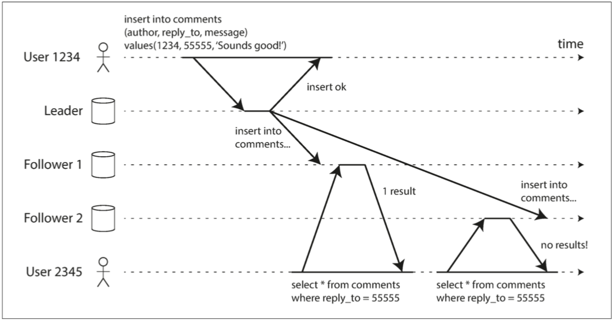

# Part II: Distributed Data
* Scaling
    * Shared-memory (scale up / vertical scaling): many CPU, RAM, disks joined under one operating system
        * Non-linearity: a machine twice the size cannot necessarily handle twice the load
    * Shared-disk: several machine with independent CPU and RAM, but shared disks (SAN or NAS)
        * contention and the overhead of locking limit the scalability
    * Shared-nothing (scale out / horizontal scaling): each machine uses its CPU, RAM, disks independently, coordination is done with network
## Chapter 5: Replication
* Why replication
    * geographically close to users
    * back up for availability
    * increase read throughput
* models for replication changes

| model  |      advantages      |  disadvantages |
|----------|:-------------:|------:|
| single leader (master-slave) | easy to implement | writes heavy|
| multi-leader | write performance; robust to datacenter outages|   hard to do correctly |
| leaderless | robust to node failure  |  hard to do correctly|
* single leader replication
    * sync vs. async: whether wait for response of follower replication
    
        * durability vs. performance
    * replicate data to new followers
        * snapshot + delta
            * snapshot is associated with its position in replication log
    * node outage
        * follower failure: follower knows last transaction, ask leader new changes to catch-up
        * leader failure: failover (promotes a follower to ne new leader)
            * automatic failover
                * determining that the leader has failed: timeout
                * choose new leader: election process
                * reconfig system to use new leader
            * problem of failover
                * loose updates: not up-to-date replica elected as new leader
                * split brain: 2 leaders working
                * tricky timeout: neither too long or too short are good
    * replication logs implementation
        * statement-based: log write (inset/update/delete) statement
            * problems: 
                * nondeterministic function (i.e. now()): a workround is the leader replace any nondeterministic function calls with a fixed return value
                * autoincrementing column
                * side-effect statements (trigger)
        * WAL: low level log
            * disadvantage
                * tight couples with storage engine (disk blocks)
                * no backward compatibility: zero-downtime upgrade is impossible if storage format changed
        * logical (row-based) log replication: log new values of the row
            * backward compatibility: decoupled from the storage engine internals
            * easy to read: facilitate external applications
                * custom indexes and caches
                * CDC (change data capture)
            > MySQL’s binlog can be configured to use row-based replication
        * trigger based replication: use custom code for more complex logic
    * problems with replication lag
        * eventual consistency can be used to solve replication lag
        * more strict consistency models: 
            * Reading your own writes: lose writes problem
            
                * solution
                    * read from leader if the data may be modified by himself (i.e. use's own profile)
                    * client track lastupdate time: read leader if too new
                        * complicated accross multiple devices
            * monotonic reads: moving backward in time problem
            
                * solution
                    * always read from the same replica for a single user (doesn't work when replica fails)
            * consistent prefix reads: 
            
                * problem when multi-partitions
                * solution: causally related writes are written to same partition
            * stronger guarantees require transactions or consensus
* multi-leader replication

    * when to use
        * multi-center
            * 1 leader in each datacenter, each leader replicates its changes to leaders in other datacenters
        * client with offline operation
            * each client/device as datacenter
            * client persist changes when offline
            * client-server sync
        > CouchDB is designed for this mode of operation
        * Collaborative editing
            * for faster collaboration, you may want to make the unit of change very small (e.g., a single keystroke) and avoid locking
            * multiple users edit simultaneously which requires conflict resolution
    * handling write conflicts
        > The biggest problem with multi-leader replication is that write conflicts can occur, which means that conflict resolution is required
        * conflict detection
            * synchronous detection (single-leader way):  wait for write to be replicated to all replicas before telling user the write was successful. 
                * loose the ability of write independency
        * conflict avoidance
            * route all writes of a user's own data to the same home datacenter to avoid conflicts
                * data center failure can make this solution break down
        * converging to a consistent state
            * ways of convergent conflict resolution
                * order determination
                    * use timestamp for each write and LWW (last write wins): prone to data loss
                    * order replica with id, writes that originated at a higher-numbered replica always take precedence over writes that originated at a lower-numbered replica: prone to data loss
                    * order the values and concat them ([B, C] -> B/C)
                * custom resolution
                    * record conflicts and all versions, resolve the conflict later                         
                        * on write: write custom code for resolution by business logic
                        * on read: prompt user for manual resolution
                * automatic resolution
                    * [Conflict-free replication datatypes (CRDT)](https://en.wikipedia.org/wiki/Conflict-free_replicated_data_type): a family of data structures for sets, maps, ordered lists, counters, etc. that can be concurrently edited by multiple users, and which automatically resolve conflicts in sensible ways
                    * Mergable persistent data structures: 3-way merge similar to Git version control
                    * Operational transformation (Google doc way): designed particularly for concurrent editing of an ordered list of items, such as the list of characters that constitute a text document
            * conflict resolution is row/document level instead of transaction level, each write in transaction is resolved separately
    * replication topologies: communication path of change propagation
        * circular, star: may suffer single point failure
        * all-to-all: may suffer consistent prefix reads problem
* leaderless replication
    > Riak, Cassandra, and Voldemort are open source datastores with leaderless replication models inspired by Dynamo, so this kind of database is also known as Dynamo-style
    
    
    * when to use
        * multi-datacenter operation: leaderless replication is designed to torlerate conflicting concurrent writes, network interruptions, and latency spikes
            * lantency spikes: client only need to wait for the quorum to response
    * read and writes
        * read/write requests are sent to multiple nodes in parallel
            * a certain number of 'OK's is required to mark the request success, see quorum consistency
        * version number is used to determine the staleness
            * latest value is returned as response
        * keep data up-to-date after node recovery
            * read repair: 
                * detect stale replica during read, and write the up-to-date value back
                * doesn't work well when values are read infrequently
            * anti-entropy
                * background process looking for staleness and fix it
        * quorums consistency for read and write
            * `w + r > n`
                * `n` replicas
                * every write must be confirmed by `w` nodes to be considered successful
                * query at least `r` nodes for each read. 
                * with `w + r > n`, at least one of the `r` nodes we’re reading from must be up to date
            * choices of `w` and `r`
                * `w = r = (n + 1) / 2`: read, write balanced
                * `w = n, r = 1`: many reads, few writes
    * limitation of quorum consisitency: 
        * even with `w + r > n`, stale value may be returned
            * when sloppy quorum is used: w writes may end up on different nodes than the r reads
            * when LWW resolution is used for concurrent write conflict: writes can be lost due to clock skew
            * read after a partially success write will be nondeterministic
        * [problems with replication lag](#rep_lag_problem) may occur in leaderless
    * Sloppy Quorums and Hinted Handoff
        * quorums is a CP model: during network partition, quorum can't be reached, an error is responsed as not available
        * sloppy quorum and hinted handoff for availability
            * writes and reads still require w and r successful responses
            * sloppy: if home partition is not available, the n nodes can be in other partition, writes can be temporarily put into other partitions
            * hinted handoff: when network back to normal, any temporary writes on behalf of another node are sent to the appropriate “home” nodes
        * stale value: with sloppy quorum, you cannot be sure to read the latest value for a key, because the latest value may have been temporarily written to some nodes outside of n
    * Detecting concurrect writes
        * happens before causality: An operation A happens before another operation B if B knows about A, or depends on A, or builds upon A in some way
        * possible relationships between 2 operations A and B: 
            * A happens before B
            * B happens before A
            * A and B are concurrent
        * capturing happens before
            * version number: for single replica
            
                * server
                    * server maintains a version number for every key, and increase on each write
                    * server keeps all concurrent versions, and return them in w/r response
                    * on receiving write, server overwrites all values with that version number or below, increases and returns the version number
                * client write
                    1. A key must be read, and the latest version number is returned as base version number
                    2. merge conflict before write 
                    3. A write should indicate its base version number as well as new value (base_version_number, new_value)
            * version vectors: for multiple replica
                * a version number per (key, replica)
                * each replica keeps track of the version numbers it has seen from each of the other replicas
                > A few variants of this idea are in use, but the most interesting is probably the dotted version vector, which is used in Riak 2.0
## To-read list
* [WAL internals fof PGSQL](https://www.pgcon.org/2012/schedule/attachments/258_212_Internals%20Of%20PostgreSQL%20Wal.pdf)
* Auto conflict resolution
    * CRDT: 
        * [A comprehensive study of Convergent and Commutative Replicated Data Types](https://hal.inria.fr/file/index/docid/555588/filename/techreport.pdf)
        * [v] [Riak's CRDT](https://gist.github.com/russelldb/f92f44bdfb619e089a4d)
    * Mergable persistent data structures
    * Operational transformation
* [Dynamo: Amazon’s Highly Available Key-Value Store](https://www.allthingsdistributed.com/files/amazon-dynamo-sosp2007.pdf)
* clock vector, version vector
    * [version-vectors-are-not-vector-clocks](https://haslab.wordpress.com/2011/07/08/version-vectors-are-not-vector-clocks/)
    * [vector-clocks-revisited-part-2-dotted-version-vectors](https://riak.com/posts/technical/vector-clocks-revisited-part-2-dotted-version-vectors/)