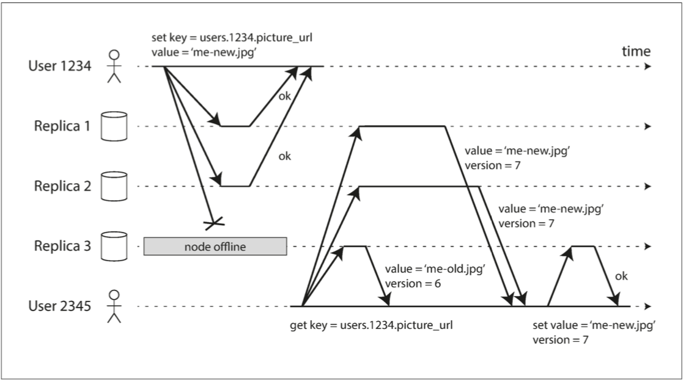

# Part II: Distributed Data
* Scaling
    * Shared-memory (scale up / vertical scaling): many CPU, RAM, disks joined under one operating system
        * Non-linearity: a machine twice the size cannot necessarily handle twice the load
    * Shared-disk: several machine with independent CPU and RAM, but shared disks (SAN or NAS)
        * contention and the overhead of locking limit the scalability
    * Shared-nothing (scale out / horizontal scaling): each machine uses its CPU, RAM, disks independently, coordination is done with network
## Chapter 5: Replication
* Why replication
    * geographically close to users
    * back up for availability
    * increase read throughput
* Models for replication changes

| model  |      advantages      |  disadvantages |
|----------|:-------------:|------:|
| single leader (master-slave) | easy to implement | writes heavy|
| multi-leader | write performance; robust to datacenter outages|   hard to do correctly |
| leaderless | robust to node failure  |  hard to do correctly|
* Single leader replication
    * sync vs. async: whether wait for response of follower replication
    
        * durability vs. performance
    * Replicate data to new followers
        * snapshot + delta
            * snapshot is associated with its position in replication log
    * Node outage
        * Follower failure: follower knows last transaction, ask leader new changes to catch-up
        * Leader failure: failover (promotes a follower to ne new leader)
            * Automatic failover
                * determining that the leader has failed: timeout
                * choose new leader: election process
                * reconfig system to use new leader
            * Problem of failover
                * loose updates: not up-to-date replica elected as new leader
                * split brain: 2 leaders working
                * tricky timeout: neither too long or too short are good
    * Replication logs implementation
        * Statement-based: log write (inset/update/delete) statement
            * problems: 
                * nondeterministic function (i.e. now()): a workround is the leader replace any nondeterministic function calls with a fixed return value
                * autoincrementing column
                * side-effect statements (trigger)
        * WAL: low level log
            * disadvantage
                * tight couples with storage engine (disk blocks)
                * no backward compatibility: zero-downtime upgrade is impossible if storage format changed
        * Logical (row-based) log replication: log new values of the row
            * backward compatibility: decoupled from the storage engine internals
            * easy to read: facilitate external applications
                * custom indexes and caches
                * CDC (change data capture)
            > MySQL’s binlog can be configured to use row-based replication
        * Trigger based replication: use custom code for more complex logic
    * Problems with replication lag
        * eventual consistency can be used to solve replication lag
        * more strict consistency models: 
            * Reading your own writes: lose writes problem
            
                * solution
                    * read from leader if the data may be modified by himself (i.e. use's own profile)
                    * client track lastupdate time: read leader if too new
                        * complicated accross multiple devices
            * Monotonic reads: moving backward in time problem
            
                * solution
                    * always read from the same replica for a single user (doesn't work when replica fails)
            * Consistent prefix reads: 
            
                * problem when multi-partitions
                * solution: causally related writes are written to same partition
            * Stronger guarantees require transactions or consensus
* multi-leader replication

    * When to use
        * Multi-center
            * 1 leader in each datacenter, each leader replicates its changes to leaders in other datacenters
        * Client with offline operation
            * each client/device as datacenter
            * client persist changes when offline
            * client-server sync
        > CouchDB is designed for this mode of operation
        * Collaborative editing
            * for faster collaboration, you may want to make the unit of change very small (e.g., a single keystroke) and avoid locking
            * multiple users edit simultaneously which requires conflict resolution
    * Handling write conflicts
        > The biggest problem with multi-leader replication is that write conflicts can occur, which means that conflict resolution is required
        * Conflict detection
            * synchronous detection (single-leader way):  wait for write to be replicated to all replicas before telling user the write was successful. 
                * loose the ability of write independency
        * Conflict avoidance
            * route all writes of a user's own data to the same home datacenter to avoid conflicts
                * data center failure can make this solution break down
        * Converging to a consistent state
            * Ways of convergent conflict resolution
                * Order determination
                    * use timestamp for each write and LWW (last write wins): prone to data loss
                    * order replica with id, writes that originated at a higher-numbered replica always take precedence over writes that originated at a lower-numbered replica: prone to data loss
                    * order the values and concat them ([B, C] -> B/C)
                * Custom resolution
                    * record conflicts and all versions, resolve the conflict later                         
                        * on write: write custom code for resolution by business logic
                        * on read: prompt user for manual resolution
                * Automatic resolution
                    * [Conflict-free replication datatypes (CRDT)](https://en.wikipedia.org/wiki/Conflict-free_replicated_data_type): a family of data structures for sets, maps, ordered lists, counters, etc. that can be concurrently edited by multiple users, and which automatically resolve conflicts in sensible ways
                    * Mergable persistent data structures: 3-way merge similar to Git version control
                    * Operational transformation (Google doc way): designed particularly for concurrent editing of an ordered list of items, such as the list of characters that constitute a text document
            * Conflict resolution is row/document level instead of transaction level, each write in transaction is resolved separately
    * Replication topologies: communication path of change propagation
        * circular, star: may suffer single point failure
        * all-to-all: may suffer consistent prefix reads problem
* Leaderless replication
    > Riak, Cassandra, and Voldemort are open source datastores with leaderless replication models inspired by Dynamo, so this kind of database is also known as Dynamo-style
    
    
    * When to use
        * multi-datacenter operation: leaderless replication is designed to torlerate conflicting concurrent writes, network interruptions, and latency spikes
            * lantency spikes: client only need to wait for the quorum to response
    * Read and Writes
        * read/write requests are sent to multiple nodes in parallel
            * a certain number of 'OK's is required to mark the request success, see quorum consistency
        * version number is used to determine the staleness
            * latest value is returned as response
        * keep data up-to-date after node recovery
            * read repair: 
                * detect stale replica during read, and write the up-to-date value back
                * doesn't work well when values are read infrequently
            * anti-entropy
                * background process looking for staleness and fix it
        * quorums consistency for read and write
            * `w + r > n`
                * `n` replicas
                * every write must be confirmed by `w` nodes to be considered successful
                * query at least `r` nodes for each read. 
                * with `w + r > n`, at least one of the `r` nodes we’re reading from must be up to date
            * choices of `w` and `r`
                * `w = r = (n + 1) / 2`: read, write balanced
                * `w = n, r = 1`: many reads, few writes
    * Limitation of quorum consisitency: 
        * even with `w + r > n`, stale value may be returned
            * when sloppy quorum is used: w writes may end up on different nodes than the r reads
            * when LWW resolution is used for concurrent write conflict: writes can be lost due to clock skew
            * read after a partially success write will be nondeterministic
        * [problems with replication lag](#rep_lag_problem) may occur in leaderless
    * Sloppy Quorums and Hinted Handoff
        * quorums is a CP model: during network partition, quorum can't be reached, an error is responsed as not available
        * sloppy quorum and hinted handoff for availability
            * writes and reads still require w and r successful responses
            * sloppy: if home partition is not available, the n nodes can be in other partition, writes can be temporarily put into other partitions
            * hinted handoff: when network back to normal, any temporary writes on behalf of another node are sent to the appropriate “home” nodes
        * stale value: with sloppy quorum, you cannot be sure to read the latest value for a key, because the latest value may have been temporarily written to some nodes outside of n
    * Detecting concurrect writes
        * happens before causality: An operation A happens before another operation B if B knows about A, or depends on A, or builds upon A in some way
        * possible relationships between 2 operations A and B: 
            * A happens before B
            * B happens before A
            * A and B are concurrent
        * capturing happens before
            * version number: for single replica
            
                * server
                    * server maintains a version number for every key, and increase on each write
                    * server keeps all concurrent versions, and return them in w/r response
                    * on receiving write, server overwrites all values with that version number or below, increases and returns the version number
                * client write
                    1. A key must be read, and the latest version number is returned as base version number
                    2. merge conflict before write 
                    3. A write should indicate its base version number as well as new value (base_version_number, new_value)
            * version vectors: for multiple replica
                * a version number per (key, replica)
                * each replica keeps track of the version numbers it has seen from each of the other replicas
                > A few variants of this idea are in use, but the most interesting is probably the dotted version vector, which is used in Riak 2.0
## Chapter 6: Partitioning
* Why partitioning: scalability, shared-nothing
* Partitioning and Replication can be combined together

* partitioning strategy
    * partition by key range
        * keys in each partition can be sorted for quick range scan
        * may lead to hot spot
            * do not use timestamp for the partition key
    * partition by hash of key
        * n = map(hash(key)): map hash value to a node
        > Note: [Not to use hash % N](#no_hash_mod_N): 
        * no support for range queries
    * combined strategy (Cassandra) 
        * compound primary key: (user_id + update_timestap)
            * first part (user_id) is hashed as partition key
            * others are concatinated as concatinated index for range scan
* Skewed workloads
    * extreme case: all reads/writes for same key
        * workaround:
            * write: add random prefix to split the key into multiple keys, distribute them to different partitions
            * read: read all possible random prefixed keys
    * it's application's responsibility to reduce the skew
* Second indexes in Partitioning
    * local index: partition index by document
    
        * each partition maintains its own secondary indexes, covering only the documents in that partition
        * (+) quick in-partition index update
        * (-) expensive read: scatter/gather way of query on second index
    * global index: partition index by term
    
        * 'term' refers to the column to be used as index key
        * global index indexes all the data and is partitioned in its own way
        * (+) efficient read: only partitions containing the key need to be requested for read
        * (-) slow write:
            * multiple partitions need to be updated
            * changes to indexes are not reflected immediately
* Rebalancing partitions
    * Strategies
        * Not to use hash % N: 
        > The problem with the mod N approach is that if the number of nodes N changes, most of the keys will need to be moved from one node to another.
        >
        >...it’s best to divide the possible hashes into ranges and assign each range to a partition, (e.g., assign key to partition 0 if 0 ≤ hash(key) < b0, to partition 1 if b0 ≤ hash(key) < b1, etc.)
        * Fix number partition
            * partitions are assigned to nodes
            * when adding a new node, just move some partitions from existing nodes to it
            * hard to determine the partition number
        * Dynamic partitioning
            * partitions are splitted and shrink dynamically according to the size
            * splitted partitions are transfered to other nodes for load balance
            * (+) number of partitions adapts to the total data volume
                * few partitions when small amount of data
                * partition size are limited by splitting threshold
        * partitioning propotional to nodes (Cassandra)
            * a fixed number of partitions per node
            * when adding a new node, just split some partitions on existing nodes, and move to it
* Request routing (service discovery)

    * approaches
        * though any node (Cassandra, Riak): client contacts any node, the node forwards reqeust to proper node and passes back the response
        * through routing tier (Mongodb)
        * partition assignment awareness
    * implementation
        * coordingation service like zookeeper for metadata
            * client/routing tier subscribes to events like partition changes, node add/remove in ZK
            * each node register itself
            * ZK maintains mapping of partitions to nodes, and notifies the subscriber when event coccurs
    * parallel query excution
        > The MPP query optimizer breaks this complex query into a number of execution stages and partitions, many of which can be executed in parallel on different nodes of the database cluster
## Chapter 7: Transactions
* ACID
    * Atomicity
        * a group of actions can either be committed or aborted
    * Consistency
        * while AID are properties of database, C is a property of application
    * Isolation
        * concurrent transactions are isolated from each other, as if they are run serially
    * Durability
        * once committed, data can not be lost
* Weak Isolation Levels
    * Read Committed
        * No dirty reads: only read committed value
        * No dirty writes: only overwrite commited value
        * Implementation
            * Row-level locks
                * writes acquire and keep locks until end of transaction
                * reads acquire locks and release immediately after reading
            > writes in lock-based isolation implementations, regardless of the isolation level (even read uncommitted), always acquire locks and keep it until the end of the transaction. 
            >
            > All isolation level implementations prevent dirty writes
            * Disadvantage of Row-based locks
                * long running write transactions will block read-only transactions until it's completion
            * Read committed snapshot
                * database remembers both the old committed value (snapshot) and new value set by the transaction that currently holds the write lock.
                * While the transaction is ongoing, any other transactions that read the object are simply given the old value
                * When the new value is committed do transactions switch over to reading the new value.
    * Snapshot isolation and Repeatable read            
        * Read skew / Nonrepeatable read: A client sees different parts of the database at different points in time.
        * Snapshot isolation: 
            * each transaction sees a snapshot of data during execution
            * key principle: readers never block writers, and writers never block readers
            * good for long running read-only transactions
            * MVCC (multi-version concurrency control) implementation
            
                * implementation
                    * datatbase maintians a unique increasing transaction id (txid) for each transaction
                    * each update is decomposed into
                        * a delete: mark data deleted by setting `deleted_by = txid`
                        * a create: add new row and set `created_by = txid`
                    * visibility rules: a transaction A, will ignore all the values
                        * created by ongoing transactions at the beginning of A
                        * created by other transactions (with higher txid) after the beginning of A
                * indexes: how to index different snapshots
                    * persistent B tree (COW): each transaction see its own version of root
    * Preventing Lost Updates
        * Lost updates: overwrite during read-modify-write cycle
            * read committed or snapshot isolation can not prevent lost updates
        * Solutions
            * automatic write operation: use update instead of read-modify-write cycle
            ~~~SQL
            UPDATE counters SET value = value + 1 WHERE key = 'foo';
            ~~~
            * Explicit locking: use update lock hint (`SELECT ... FOR UPDATE`) when reading, prevent selected data being updated by others by exclusively lock them
            ~~~SQL
            BEGIN TRANSACTION;

            SELECT * FROM figures
            WHERE name = 'robot' AND game_id = 222
            FOR UPDATE; 

            -- Check whether move is valid, then update the position
            -- of the piece that was returned by the previous SELECT.
            UPDATE figures SET position = 'c4' WHERE id = 1234;

            COMMIT;
            ~~~
            * Automatically detecting lost updates: database detects the lost update and abort transaction
            * CAS (Compare-and-set)
                * fail to prevent lost updates if the database allows the WHERE clause to read from an old snapshot
            ~~~SQL
            -- This may or may not be safe, depending on the database implementation
            UPDATE wiki_pages SET content = 'new content'
            WHERE id = 1234 AND content = 'old content';
            ~~~
    * Write Skew and Phantoms
        * Write Skew: generalized lost-update problem
        
        * Solution: Serializable isolation
* Serializability
    * Serializable isolation: It guarantees that even though transactions may execute in parallel, the end result is the same as if they had executed one at a time, serially, without any concurrency
    * Implementations
        * Serial Execution: 
            * single threaded execution
                * transactions are fast: all data are in memory, no need to wait for data to be loaded from disk
                * transactions are short with small number of reads and writes
            * Stored procedure
        * TPL (Two-Phase Locking)
            * S(shared lock) and X(exclusive lock)
                * Bad performance, deadlocks
            * predicate locks
                * apply to all objects that match some search condition
            * index-ranged locks
                * lock a key range in index
                * if there is no suitable index where a range lock can be attached, the database can fall back to a shared lock on the entire table. This will not be good for performance
        * SSI (Serializable Snapshot Isolation): snapshort isolation + serialization conflicts detection
            * optimistic concurrency control
                * Good performance when low concurrency
            * serialization conflicts detection
                * Detecting stale MVCC reads
                
                    * When the transaction wants to **commit**, the database checks whether any of the ignored writes (according to [visibility rule of snapshor isolation](#MVCC_visibiliy)) have now been committed. If so, the transaction must be aborted
                * Detecting writes that affect prior reads
                
            * Perforamance
                * no lock, good for read heavy tasks
                * multi-core can be utilized
* Isolation levels by race conditions
    * Dirty reads
        * One client reads another client’s writes before they have been committed. The read committed isolation level and stronger levels prevent dirty reads.
    * Dirty writes
        * One client overwrites data that another client has written, but not yet committed. **Almost all transaction implementations prevent dirty writes.**
    * Read skew (nonrepeatable reads)
        * A client sees different parts of the database at different points in time. This issue is most commonly prevented with snapshot isolation, which allows a transaction to read from a consistent snapshot at one point in time. It is usually implemented with multi-version concurrency control (MVCC).
    * Lost updates
        * Two clients concurrently perform a read-modify-write cycle. One overwrites the other’s write without incorporating its changes, so data is lost. Some implementations of snapshot isolation prevent this anomaly automatically, while others require a manual lock (SELECT FOR UPDATE).
    * Write skew
        * A transaction reads something, makes a decision based on the value it saw, and writes the decision to the database. However, by the time the write is made, the premise of the decision is no longer true. Only serializable isolation prevents this anomaly.
    * Phantom reads
        * A transaction reads objects that match some search condition. Another client makes a write that affects the results of that search. Snapshot isolation prevents straightforward phantom reads, but phantoms in the context of write skew require special treatment, such as index-range locks.  
## Chapter 8: The Trouble with Distributed Systems
* Faults and partial failures
    * partial failure: here may well be some parts of the system that are broken in some unpredictable way, even though other parts of the system are working fine
    * build fault-tolerance mechanisms: we must accept the possibility of partial failure and build fault-tolerance mechanisms into the software. (build a reliable system from unreliable components)
        * examples are checksum for error-correcting codes, reliable TCP over unreliable IP
* Unreliable network
    * possible causes for no response
    
    * Detecting faults: timeouts
        * Variability of network delays is often due to queueing
        * timeouts can be adjust according to the observed time distribution: [Phi Accrual failure detector](http://ternarysearch.blogspot.com/2013/08/phi-accrual-failure-detector.html)
* Unreliable clocks
    * 2 kinds of clocks
        * Time-of-Day clocks: wall-clock time
            * synchronization such as NTP required to be useful
        * Monotonic clocks: always move forward. 
            * Estimate time elapsed with difference of monotonic clock
    * Relying on synchronized clocks
        * clocks can go wrong but unnoticed
        * rely on clokcs for ordering events can be dangerous: causaully happens after write, but overwritten by earlier event by LWW rule
        
    * Process pauses
        * process puases can make non-carefully-designed algorithms fail: such as lease update
        * process pauses can be caused by 
            * GC collection
            * suspend and resume VM
            * OS context switch
            * synchronous IO
* Knowledge, truth and lies
    * The truth is defined by majority
        * a node cannot necessarily trust its own judgment of a situation
        * many distributed algorithms rely on a **majority quorum** voting
            * allows system to continue work if several individual nodes fail
            * there is one and only one majority in system at the same time, so conflicts can be avoided
        * Use fencing tokens to guarantee only one of something
            * Problem: A former leader may believe it's still the 'chosen leader' while other nodes declared it dead and promoted a new leader in the meantime
                * fencing tokens solution
                
                    * a lock server grants tokens with increasing numbers to leaders
                    * clients ignore tokens with lower number then current highest token they have seen
    * Byzantine faults
        * Non-byzantine faults: 
            * nodes are unreliable but honest: they may be slow or never respond (due to a fault), and their state may be outdated (due to a GC pause or network delays), but we assume that if a node does respond, it is telling the “truth”: to the best of its knowledge, it is playing by the rules of the protocol
        * Byzantine faults:
            * nodes may lie: claim to receive message when in fact they didin't
        * Byzantine faults tolerant
            * Avoiding client's malicious behaviors in Web applications is not considered Byzantine fault-tolerant for server can be the central authority and allow or deny the behaviors
            * P2P network with no center of authority can be treated as Byzantine faults-tolerant relavant
            * Byzantine faults tolerant can not save you if all nodes are compromised
    * System models
        * System model: abstractions and assumptions of algorithm
            * models by timing assumptions
                * synchronous model 
                    * bounded network delay, bounded process pauses, and bounded clock error
                    * not practical
                * partially synchronous model
                    * behaves like a synchronous system most of the time, but it sometimes exceeds the bounds for network delay, process pauses, and clock drift
                    * realistic model for systems
                * asynchronous model
                    * no time assumptions, even no clock, 'timeouts' cannot be used
                    * too restrictive
            * models by node failures
                * crash-stop faults: a node crashs and never comes back
                * crash-recovery faults: 
                    * a node can recover after crash 
                    * a node has stable storage which preserves across crashes
                    * a node in-memory state is assumed to be lost across crashes
                * Byzantine faults: Nodes may do absolutely anything, including trying to trick and deceive other nodes
        * Correctness of an algorithm
            * correctness boilds down to properties: 'safety' and 'aliveness'
                * safety: nothing bad happens
                    * After a safety property has been violated, the violation cannot be undone—the damage is already done.
                * aliveness: something good will eventually happens
                    * it may not hold at some point in time, but there is always hope that it may be satisfied in the future
            * We can prove algorithms correct by showing that their properties always hold in some system model
## To-read list
* Chapter 5
    * [WAL internals fof PGSQL](https://www.pgcon.org/2012/schedule/attachments/258_212_Internals%20Of%20PostgreSQL%20Wal.pdf)
    * Auto conflict resolution
        * CRDT: 
            * [A comprehensive study of Convergent and Commutative Replicated Data Types](https://hal.inria.fr/file/index/docid/555588/filename/techreport.pdf)
            * [x] [Riak's CRDT](https://gist.github.com/russelldb/f92f44bdfb619e089a4d)
        * Mergable persistent data structures
        * Operational transformation
    * [Dynamo: Amazon’s Highly Available Key-Value Store](https://www.allthingsdistributed.com/files/amazon-dynamo-sosp2007.pdf)
    * clock vector, version vector
        * [version-vectors-are-not-vector-clocks](https://haslab.wordpress.com/2011/07/08/version-vectors-are-not-vector-clocks/)
        * [vector-clocks-revisited-part-2-dotted-version-vectors](https://riak.com/posts/technical/vector-clocks-revisited-part-2-dotted-version-vectors/)
* Chapter 6
    * parallel query processing
        * [Parallel Database Systems: The Future of High Performance Database Systems](http://www.cs.cmu.edu/~pavlo/courses/fall2013/static/papers/dewittgray92.pdf)
        * [Massively Parallel Databases and MapReduce System](https://www.microsoft.com/en-us/research/wp-content/uploads/2013/11/db-mr-survey-final.pdf)
* Chapter 8
    * Spanner: Google’s Globally Distributed Database
        * [paper](https://research.google/pubs/pub39966/)
        * [another post](http://muratbuffalo.blogspot.com/2013/07/spanner-googles-globally-distributed_4.html)
    * [Time-Clocks-and-the-Ordering-of-Events-in-a-Distributed-System](https://www.microsoft.com/en-us/research/publication/time-clocks-ordering-events-distributed-system/?from=http%3A%2F%2Fresearch.microsoft.com%2Fen-us%2Fum%2Fpeople%2Flamport%2Fpubs%2Ftime-clocks.pdf)