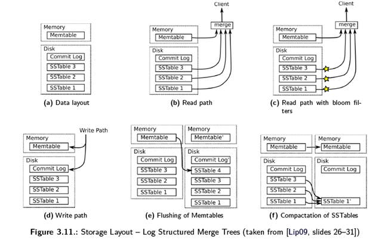
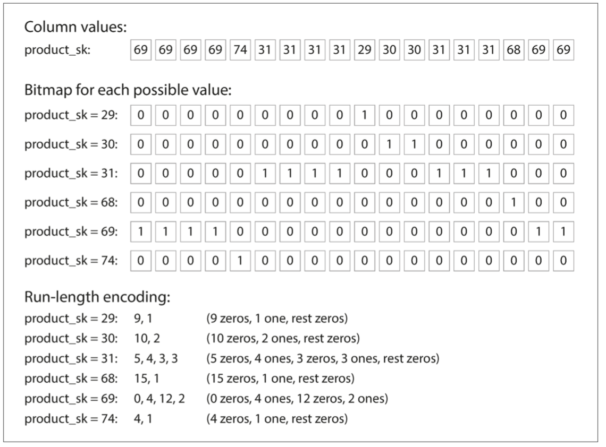

## Questions
1. SStable delete
## Chapter 1: Reliability, Scalability, Maintainability
* Reliability: fault-tolerant, resilient
	* fault: “A fault is usually defined as one component of the system deviating from its spec”
		* hardware, software, human
* Scalability: a system’s ability to cope with increased load
	* Load parameters: QPS, R/W rate, concurrency #, cache hits
	* Describing load: throughput for batch systems, percentiles for describe response time for online system
	* Cope with load: scale up/out, elastic
* Maintainability
	* operability: make life easy
		* visibility for system's health
	* simplicity: manage complexity
		* “One of the best tools we have for removing accidental complexity is abstraction”
	* evolvability

## Chapter 2: Data Models and query languages
* NoSQL: driving forces
	* greater scalability: large datasets or high write throughput
	* free and open source
	* Specialized query operations that are not well supported by the relational model
	* schema-less, dynamic and expressive data model
* Modeling
	* Relational
		* Good support for many-to-1 and many-to-many through joins
		* schema-on-write
	* Document: self contained data
		* Good for 1-to-many: self contained, tree representation
			* schema flexibility: schema-on-read
			* good locality when
				* doc not too large or deep
				* less writes/updates
		* Bad for many-to-1 and many-to-many
			* no support for join
			* limited support for relationships between one document and another
		* Network (Graph): modeling vertices and edges
			* Model
				* Property graph

				~~~SQL
				CREATE TABLE vertices (
					vertex_id   integer PRIMARY KEY,
					properties  json
				);
					
					
				CREATE TABLE edges (
					edge_id     integer PRIMARY KEY,
					tail_vertex integer REFERENCES vertices (vertex_id),
					head_vertex integer REFERENCES vertices (vertex_id),
					label       text,
					properties  json
				);
				
				
				CREATE INDEX edges_tails ON edges (tail_vertex);
				CREATE INDEX edges_heads ON edges (head_vertex);
				~~~

				* Triplet-store (used in RDF):
	
				~~~
				(subject, predicate, object)
				(lucy, age, 33)
				~~~
			
			* Query Language
				* Cypher: declarative query language for property graphs model like Neo4j

				~~~SQL
				MATCH
				(person) -[:BORN_IN]->  () -[:WITHIN*0..]-> (us:Location {name:'United States'}),
				(person) -[:LIVES_IN]-> () -[:WITHIN*0..]-> (eu:Location {name:'Europe'})
				RETURN person.name
				~~~
			
				* SPARQL: declarative query language for triple-stores using the RDF data model

				~~~SQL
				SELECT ?personName WHERE {
				?person :name ?personName.
				?person :bornIn  / :within* / :name "United States".
				?person :livesIn / :within* / :name "Europe".
				}
				~~~
				
			* Datalog: prolog for graph data query
				* `predicate(subject, object)`
* Query Language
	* SQL: declarative, hide query engine implementation such as query optimization (parallelization)...
	* Mapreduce: functional (non-declarative nor imperative)
	* Mongodb implements both MR and declarative query (pipeline)

## Chapter 3: Storage and Retrieval
* Log structured storage engine
	1. Hash indexes

		* when to use: key set is not large and can be stored in memory
		* data structure
			* in-mem hashtable: K -> offset
			* log structured data file: records data
		* update: append to data file, update offset in hashtable
		* delete: append a tombstone (a special deletion record) to the data file
		* segment files and compaction
			* segement files: break the log into segments of a certain size by closing a segment file when it reaches a certain size, and making subsequent writes to a new segment file 
			* compaction: merge segments by keeping the latest value
		* crash recovery: 
			* (slow) reconstruct in-mem hashtable by read all segments
			* (speedup) storing a snapshot of each segment’s hash map on disk, which can be loaded into memory more quickly during recovery
		* concurrency
			* write: writes are appended to the log in a strictly sequential order, a common implementation choice is to have only one writer thread. 
			* read: Data file segments are append-only and otherwise immutable, so they can be read concurrently by multiple threads.
		* advantages
			* sequential writes are faster than random writes
			* immutable/AO files for easier crash recovery and concurrency
			* space management by merging old segments
		* limitations
			* The full key set should fit in memory
			* range queries are not efficient
	2. SSTables and LSM-Tree
		* no limitations of hash indexes
			* arbitary sized key set
			* range query supported

			
		* Log-Structured Merge-Tree
			* data structure
				* memtable: K -> V
				* event log file: redo log for memtable
				* SSTable (Sorted String Table) file / segment file:
					* K-V pairs sorted by key
					* index: K -> offset
					* bloom filter: key existance check
			* insert/update: update memtable (log event for recovery) 
			* delete: update memtabl with tombstone
			* flush to disk: when memtable grows over some threshold, flush to SSTable file, new memtable instance
			* query: first memtable -> most recent SSTable -> next older SSTable...
			* compact: bakcground compaction for obsolete records
			* recovery: event log file for restore memtable
			* optimization
				* speed up non-existing key lookup: bloom filter
				* incremental compaction for less performance impact: leveld/sieze-tiered compaction
			* advantages
				* high write throughput
				* quick segment file merge: merge sort
				* sparse memtable: no need to keep full key set in memory
				* space saving and IO bandwidth saving by compression for a key range

* page oriented storage engine
	* B-Trees

		* 1 page/fixed-sized block per node
		* update: load page, update value, write whole page back to disk
		* insert: split to 2 half-full pages when target page is full
		* recovery: WAL/redo log
		* concurrency: use latches
		* optimizations: 
			* persistent data structure (copy-on-write)for concurrency control
			* B+ Tree variants: KV pairs are only stored in leaves
				* leaf pages are sequentially on disk as possible for locality
				* additional pointers for sequential scan and range query

* Comparison
	* Log structured storage engine
		* faster writes
		* write sequentially in segment files
		* smaller files on disk for less fragmentation
		* compaction process interfere with performance of ongoing reads/writes
		* multiple copies of same key in different segments, which makes locks and transactions not easy
	* page oriented storage engine
		* faster reads
		* read/write whole page directly
		* fragmentation when node split
		* each key exists in exactly one place in the index, transaction isolation is implemented by attaching locks directly to the key in the tree
* Index
	* clustered index: store row data in the index
	* non clustered index: store reference of row data in the index
	* multi-column indexes: 
		* (lastname - firstname case) concatenated index: composite index
		* (latitude - longitude case) multi-dimentional index: R-Tree
	* fuzzy index for Full-text search
		* given a term A, search docs for terms in certain Levenshtein edit distance of A: use trie like data structure for (key, docs)store in memory and Levenshtein automaton can be used
* Memory database
	* fast data access
	* support complex data structures (map, set...)
	* optional AOF for durability
	* Use LRU to support larger datasets
* Techniques for Analytics database
	* Data warehouse
	
	|     Property     |        Transaction processing systems (OLTP)         |      Analytic systems (OLAP)       |
	| :----------: | :--------------------------: | :----------------------: |
	| Main read pattern |    Small number of records per query, fetched by key    |    Aggregate over large number of records    |
	| Main write pattern |   Random-access, low-latency writes from user input   | Bulk import (ETL) or event stream  |
	|   Primarily used by   |    End user/customer, via web application     | Internal analyst, for decision support |
	|  What data represents  | Latest state of data (current point in time) |   History of events that happened over time   |
	|  Dataset size  |           GB ~ TB            |         TB ~ PB          |
		
	* Modeling
		* Stars: dimension + fact
		* Snowflake: dimension, subdimensions + fact
	* Column Oriented Storage
		* Column Storage

		* Compression: 
			* bitmap-encoding + RLE
				* 1 bitmap for each distinct value of a column
				* RLE if bitmap is sparse

			* memory bandwidth
				* Column compression allows more rows from a column to fit in the same amount of L1 cache
			* vectorized processing
				* A vector (A block of column data) loaded into CPU cache can be processed by SIMD (i.e. bitwise AND/OR)
		* Sort order: 
			* index to filter
			* RLE encoding for 1st sort key performs well
		* Write (like LSM-Tree)
			* writes go to im-momory store in a sorted structure
			* when writes accumulated, they are merged with the column files on disk and written to new files in bulk
			* Queries need to examine both the column data on disk and the recent writes in memory
		* Aggregations: Data Cubes and Materialized Views
			* Materialized Views: precomputed aggregated data
				* acceleration for queries
				* lack of detail data

## To Reading list
